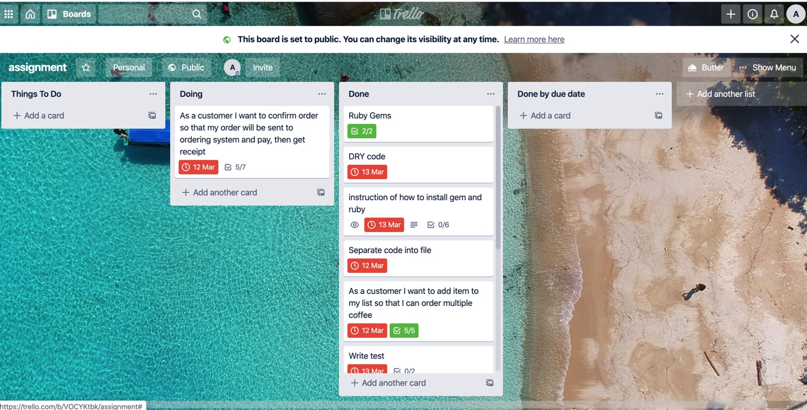

# R4 
https://github.com/ArisaOkuyama/ArisaOkuyama_T1A2
# R5 - statement of purpose and scope
When you run a cafe/restaurant, a common problem is that you don't have enough budget to hire extra staff for the rush hours. In contras, customers have to wait longer during peak time. I often see a long queue at the cafe for customers to order their morning coffee/food before they go to work.  
I have made this self-ordering application to use instead of a staff member. 
Therefore, the existing staff members can prioritize producing drinks and food. The cafe can then run as efficiently with the same number of staff.    
One similar existing system is what they use in McDonald's; a touch panel screen to order.  
The target audience will be owners of small business who wish to run their peak time smoothly with no extra labour. Users of this application will be customers of the business. Therefore, I made this application with a simple user-friendly interface for everyone, including those who don't know much about technology.
Customers will be able to place an order directly to the terminal application instead of ordering via a staff member.

# R6 - Features
1. One feature is customizing your coffee the way you like by selecting 5 different questions; coffee type, size, milk type, sugar, extra. The application will use a method to add this to your ordering list. 
The answers of each question will be saved under a local variable to create an instance of Coffee class. Then values of the instance will be used for calculating the price of coffee in the Price class.  
I used Ruby TTP Prompt for all questions so the user only selects one answer per question from the list. 
2. A second feature is calculating the price of each coffee depending on the answers of each question. The price is calculated by what kind of coffee they chose, then adding the of cost of any extras they add to their order.  
Total price of coffee will be calculated before and after removing item from order list if the user removes an item. 
3. Another feature is the choice to remove a selected item from your order list. The application outputs the order in a list with each item assigned by a numerical index starting from 1. The customer can chose the item that needs to be removed by inputting the numerical number assigned to the item on the order list. If you choose the number bigger than the order list of index number, give you an error message until the number is within the list of index number.

# R7 - User guide
This application is very easy to use with a simple user-friendly interface.  
Firstly, you will be asked to input your name for the order. If you don't enter anything or just press enter, it will loop through and give you an error message saying "Please type your name" until you input something.  
Then some questions will be displayed with options to choose from. Use ↑/↓ and ←/→ arrow keys to select your option to customize your coffee.  
After answering all the questions, a menu bar will appear, select your option from the menu bar.  
- Add item to order  
When you want to add more coffee to you order, press this menu. It takes you to further questions so add another coffee to your order.
- Remove item from order
When you want to remove items from list, choose this option. It shows the current list of your items in your order and the total price. Then type the number of the item you would like to remove and press Enter. It will show you the new order list after deleting the item with the total price. 
- View order
When you want to check your current order list. It will show you a list of your order. 
- Check out
When you want to send you order to the system after finalizing your order, choose this option. It shows your total price and list of your coffee you ordered.
- EXIT
Exit from this terminal. 

# R8 Diagram  

[Diagram](./docs/diagram.pdf)

# R9 Trello
[Trello](https://trello.com/b/VOCYKtbk/assignment)  


# R10 How to use and install the application  

### Requirements  
* Ruby **2.7.0**
* Ruby Gems  
  * TTY::Prompt
  * TTY::Font
  * TTY::Box
  * Colorize 

### Steps

1. Install Ruby **2.7.0** version to your computer if you haven't installed or updated the version.  
Install Ruby : https://www.ruby-lang.org/en/documentation/installation/
2. Install Ruby Gems. Those following gems are required to run this application
TTY::Prompt https://github.com/piotrmurach/tty-prompt  
TTY::Font  https://github.com/piotrmurach/tty-font  
TTY::Box  https://github.com/piotrmurach/tty-box  
Colorize  https://github.com/fazibear/colorize   

```
gem install tty-prompt
gem install tty-font
gem install tty-box
gem install colorize
```
3. Execute the below command to run this file.  

https://github.com/ArisaOkuyama/ArisaOkuyama_T1A2
```
ruby assignment_main.rb
```